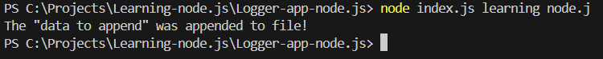
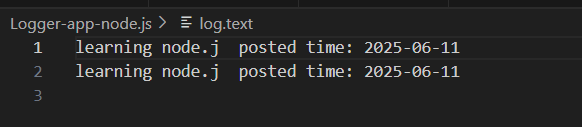

I have created a Logger app using Node.js, which stores a message entered from the command line in a log.text file. The message is stored along with the current date and time. Whenever you enter a message using Node.js in the command line, it will be saved in the log.text file with the date included.

Process:
1) The app is run using Node.js.

2) The user enters a message via the command line.

3) The app captures the message and appends the current date to it.

4) The message is then saved into a file called log.text.
